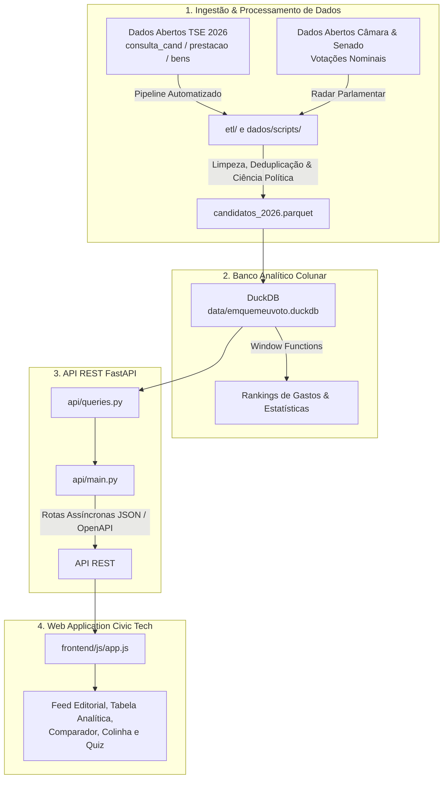

<div align="center">

# 🗳️ Em Quem Eu Voto — Eleições Gerais 2026

[](https://www.python.org/)
[](https://fastapi.tiangolo.com/)
[](https://duckdb.org/)
[](tests/)
[](https://dadosabertos.tse.jus.br/)
[](LICENSE)

**Plataforma independente, cívica e aberta de pesquisa e análise de candidaturas para as Eleições de 2026 no Brasil.**

🔗 **Acesse online:** [emquemeuvoto.onrender.com](https://emquemeuvoto.onrender.com/)

<br>


</div>

---

## 📌 Visão Geral & Diferenciais

- **Dados 100% Oficiais e Auditáveis**: Ingestão oficial dos Dados Abertos do Tribunal Superior Eleitoral (TSE), declaração de bens/patrimônio, prestação de contas de campanha e fotos de urna.
- **Transparência Parlamentar (Radar Legislativo)**: Cruzamento de votos nominais de deputados federais e senadores em matérias de relevância nacional na Câmara e no Senado.
- **Planos de Governo Integrados**: Acesso com 1 clique aos planos e propostas de governo oficiais registradas no TSE para candidatos do Poder Executivo.
- **Espectro Político Baseado em Ciência Política**: Posicionamento ideológico calculado com base na pesquisa acadêmica *Brazilian Legislative Survey (BLS 9 / Oxford-FGV / Bolognesi et al.)* e no GPS Partidário.
- **Estúdio Civic Tech**: Criação e exportação de **Santinho Digital**, **Minha Colinha Eleitoral** e **Quadro Comparador Lado a Lado** em alta resolução (PNG / PDF) ou cópia instantânea para a área de transferência.
- **Bússola / Quiz Político**: Algoritmo de proximidade euclidiana multidimensional em 7 dimensões para orientação do eleitor.
- **Design Editorial & Acessibilidade**: Interface fluida, responsiva para mobile e desktop, com suporte a modo claro e modo escuro.

---

## 🏛️ Arquitetura do Sistema



---

## 📂 Estrutura de Pastas

```text
emquemeuvoto/
├── api/                      # Backend FastAPI assíncrono
│   ├── main.py               # Rotas HTTP, middlewares e inicialização
│   ├── models.py             # Schemas Pydantic tipados
│   └── queries.py            # Queries analíticas no DuckDB
│
├── dados/scripts/            # Pipelines de dados, raspadores e atualizadores
│   ├── atualizar_tse_2026.py # Pipeline de ingestão do TSE 2026
│   └── radar_votacoes.py     # Ingestão de votações da Câmara e Senado
│
├── frontend/                 # Web Application (Vanilla JS + CSS Editorial)
│   ├── index.html            # Estrutura semântica, metatags e SEO
│   ├── css/
│   │   ├── tokens.css        # Design tokens editoriais
│   │   └── style.css         # Componentes, responsividade mobile e dark mode
│   ├── js/
│   │   ├── app.js            # Controlador principal, busca e renderização
│   │   ├── lists.js          # Gerenciador de Salvos & Colinha Eleitoral
│   │   ├── compare.js        # Comparador lado a lado
│   │   ├── quiz.js           # Bússola / Quiz de afinidade
│   │   └── export.js         # Motor gráfico em Canvas (Santinho e Colinha)
│   └── img/                  # Logotipos e banners de compartilhamento social
│
├── data/                     # Armazenamento de dados locais
│   ├── emquemeuvoto.duckdb   # Banco DuckDB colunar
│   └── processed/            # Arquivo colunar Parquet tratado
│
├── docs/                     # Relatórios metodológicos e técnicos
│   └── relatorio_metodologia_quiz_2026.pdf # Metodologia do Quiz / BLS 9
│
├── tests/                    # Bateria de testes automatizados (pytest)
│   ├── test_2026.py          # Validação matemática e integridade da base
│   ├── test_api.py           # Testes dos endpoints FastAPI
│   └── test_quiz.py          # Testes do algoritmo euclidiano do quiz
│
├── requirements.txt          # Dependências Python
├── LICENSE                   # Licença MIT e proteção de marca
└── README.md                 # Esta documentação
```

---

## 🚀 Como Executar Localmente

### Pré-requisitos
- **Python 3.11+**
- **Git**

### 1. Clonar o repositório e criar o ambiente virtual
```bash
git clone https://github.com/viniciuspinon/emquemeuvoto.git
cd emquemeuvoto

python -m venv .venv
# No Windows:
.venv\Scripts\activate
# No Linux/Mac:
source .venv/bin/activate
```

### 2. Instalar as dependências
```bash
pip install -r requirements.txt
```

### 3. Iniciar o Servidor de Desenvolvimento
```bash
python -m uvicorn api.main:app --host 127.0.0.1 --port 8000 --reload
```

- Acesse a interface web: **`http://127.0.0.1:8000`**
- Documentação interativa da API (Swagger UI): **`http://127.0.0.1:8000/docs`**

---

## 🧪 Testes Automatizados

Para rodar a suíte completa de testes automatizados com validação da API e integridade matemática:

```bash
python -m pytest tests/
```

---

## ⚖️ Neutralidade & Fontes dos Dados

- **Compromisso Cívico e Isenção**: O projeto não possui filiação partidária, financiamento político ou vínculo com candidatos ou coligações.
- **Fontes Oficiais**:
  - [Tribunal Superior Eleitoral (TSE) — Portal de Dados Abertos](https://dadosabertos.tse.jus.br/)
  - [Câmara dos Deputados — Dados Abertos](https://dadosabertos.camara.leg.br/)
  - [Senado Federal — Dados Abertos](https://www12.senado.leg.br/dados-abertos)
  - *Brazilian Legislative Survey (BLS 9)* — Oxford / FGV / Timothy J. Power e Cesar Zucco.

---

## 📜 Licença

O código-fonte está licenciado sob a [Licença MIT](LICENSE).  
A marca, identidade visual e domínios do **Em Quem Eu Voto** são reservados.
