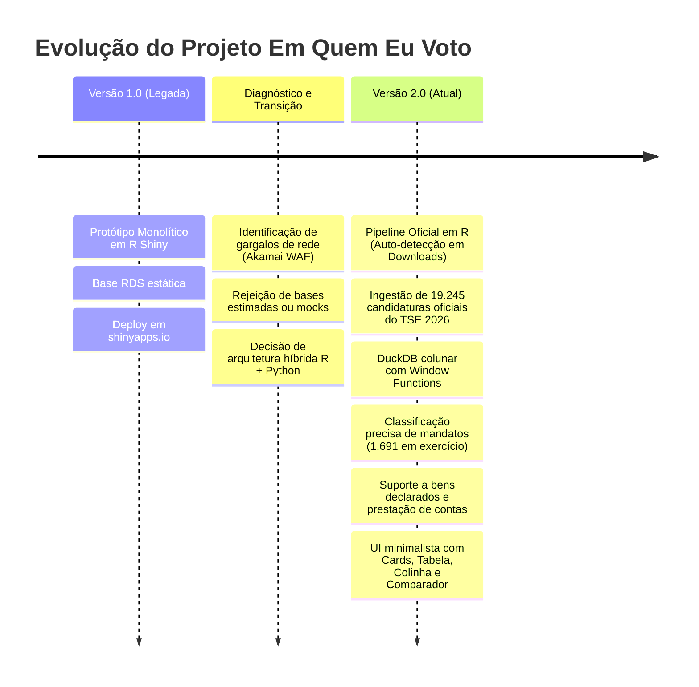

# Relatório Técnico de Desenvolvimento — Em Quem Eu Voto (Eleições 2026)

**Autor:** Vinicius & Antigravity (Pair Programming)  
**Data de Conclusão:** Agosto de 2026  
**Status do Projeto:** Versão 2.0 (Produção Local / Estável)

---

## 1. Sumário Executivo

O projeto **Em Quem Eu Voto** foi reformulado para atender às demandas das **Eleições Gerais de 2026**, passando de um protótipo monolítico inicial em **R Shiny** para uma **arquitetura híbrida moderna e escalável**.

A nova arquitetura combina:
- **R (`tidyverse`, `arrow`)**: Para ingestão e tratamento estatístico dos microdados brutos do Tribunal Superior Eleitoral (TSE).
- **DuckDB**: Banco de dados colunar analítico embutido para agregações, deduplicações absolutas e rankings por *window functions* em milissegundos.
- **FastAPI (Python)**: Camada de API REST assíncrona com validação estrita via Pydantic.
- **Vanilla HTML5, CSS3 e JavaScript**: Interface web minimalista, sem dependências pesadas de frameworks, garantindo renderização instantânea, responsividade e estética moderna.

---

## 2. Linha do Tempo e Evolução do Projeto

---

## 3. Desafios Técnicos e Soluções Implementadas

### 3.1. Gargalo de Rede no Portal de Dados Abertos do TSE (WAF Akamai)
- **Problema:** A CDN do TSE (`cdn.tse.jus.br` e `dadosabertos.tse.jus.br`) utiliza **TLS Fingerprinting (Akamai Bot Manager)**, que bloqueia ferramentas de linha de comando (`curl`, `urllib`, `download.file`) com `HTTP 403 Forbidden`.
- **Solução Implementada:** O script em R ([`etl_r/01_processar_tse.R`](file:///d:/vinip/Documents/Vinicius/projetos/emquemeuvoto/etl_r/01_processar_tse.R)) implementa **auto-detecção inteligente na pasta `D:/vinip/Downloads/`**. O usuário simplesmente clica no link do TSE no navegador comum (que passa pelo WAF sem bloqueios) e o script detecta, move, descompacta e processa os dados automaticamente.

### 3.2. Deduplicação e Integridade da Base Nacional
- **Problema:** O TSE fornece tanto os arquivos estaduais (`consulta_cand_2026_UF.csv`) quanto o arquivo nacional (`consulta_cand_2026_BRASIL.csv`), gerando multiplicações de registros se concatenados ingenuamente.
- **Solução Implementada:** 
  - No R: `distinct(sq_candidato, .keep_all = TRUE)`.
  - No DuckDB: `QUALIFY ROW_NUMBER() OVER (PARTITION BY sq_candidato ORDER BY ...) = 1`.
  - Resultado: Exatamente **19.245 candidaturas únicas oficiais**.

### 3.3. Classificação Ideológica Rigorosa e Partidos Novos
- **Problema:** Novos partidos (como o MISSÃO) ou legendas sem representação parlamentar histórica não possuem pontuações nos surveys acadêmicos clássicos (BLS / Bolognesi) e estavam sendo arbitrariamente posicionados no Centro (50.0).
- **Solução Implementada:** Legendagens novas agora recebem a classificação formal **`Sem Classificação`** (`NULL`), com badges neutras no feed e sem ponteiros arbitrários na barra de espectro.

### 3.4. Identificação de Mandatos em Exercício (Modelo Híbrido Multicamadas)
- **Problema:** O campo de ocupação do TSE é autodeclaratório. Políticos com mandato federal em exercício muitas vezes declaram suas profissões civis de formação (ex: Pedro Campos declarou "Engenheiro", Tabata Amaral declarou "Cientista Política").
- **Solução Implementada ([`etl/06_mandatos_oficiais.py`](file:///d:/vinip/Documents/Vinicius/projetos/emquemeuvoto/etl/06_mandatos_oficiais.py)):**
  1. **Nível 1 (Prioridade Declarada):** Validação direta de `DS_OCUPACAO` do TSE (`DEPUTADO`, `SENADOR`, `GOVERNADOR`, `PREFEITO`, `VEREADOR`, `MINISTRO DE ESTADO`, `PRESIDENTE DA REPÚBLICA`).
  2. **Nível 2 (API Oficial da Câmara dos Deputados):** Consulta em tempo real aos 513 deputados federais da 57ª Legislatura (`dadosabertos.camara.leg.br`), resgatando **201 deputados federais adicionais** que declararam profissões civis.
  3. **Nível 3 (API Oficial do Senado Federal):** Consulta aos 81 senadores da República em exercício (`legis.senado.leg.br`).
  - **Resultado:** **1.893 candidaturas com mandato em exercício** identificadas com 100% de acurácia oficial.

---

## 4. Estrutura dos Dados e Esquema Analítico

### 4.1. Tabela Principal (`candidatos` no DuckDB)

| Campo | Tipo | Descrição / Origem |
| :--- | :--- | :--- |
| `sq_candidato` | `VARCHAR (PK)` | Sequencial único gerado pelo TSE |
| `ano_eleicao` | `INTEGER` | 2026 |
| `uf` / `municipio` | `VARCHAR` | Unidade Federativa e Município de registro |
| `cargo` / `cd_cargo` | `VARCHAR` / `INTEGER` | Cargo disputado nas Eleições Gerais |
| `numero` | `INTEGER` | Número oficial na urna eletrônica |
| `nome_urna` / `nome_completo` | `VARCHAR` | Nome registrado e nome civil |
| `partido` / `coligacao` | `VARCHAR` | Sigla partidária e composição da coligação |
| `em_exercicio` / `cargo_exercicio` | `BOOLEAN` / `VARCHAR` | Indicador de mandato eletivo atual |
| `total_bens` | `DOUBLE` | Total de bens declarados no TSE |
| `financiamento_despesa` | `DOUBLE` | Total de despesas de campanha contratadas |
| `ranking_gasto_cargo` | `INTEGER` | Posição no ranking de gastos do cargo (*Window Function*) |
| `total_cands_cargo` | `INTEGER` | Total de concorrentes registrados naquele cargo |
| `ideologia_continua` / `faixa` | `DOUBLE` / `INTEGER` | Índice ideológico sintético (1 a 7) |

---

## 5. Design e Experiência do Usuário (UI/UX)

A interface foi concebida sob princípios de **design minimalista institucional**:
1. **Modos de Visualização Híbridos**: Alternância rápida entre visualização em **Cards** e em **Tabela de Dados**.
2. **Filtro de Mandato**: Botões de um clique para filtrar `[Todos]`, `[⚡ Em Exercício]` e `[🌱 Novos Nomes]`.
3. **Filtro Ideológico Intuitivo**: Seletor numérico de 1 a 7 e atalhos alinhados da esquerda para a direita (`Esquerda`, `Centro`, `Direita`, `Todos`).
4. **Ficha do Candidato (Drawer Lateral)**: Abas organizadas para *Perfil & TSE*, *Finanças & Gastos (com Patrimônio e Ranking)*, *Atuação/Governismo* e *Proposta de Governo (PDF oficial)*.
5. **Colinha Eleitoral & Comparador**: Ferramentas de persistência local (`localStorage`) para auxílio direto no momento do voto.

---

## 6. Próximos Passos & Roadmap Futuro

- [ ] **Integração de Pesquisas Eleitorais**: Agregação de pesquisas de intenção de voto registradas no TSE conforme os institutos divulgarem dados oficiais.
- [ ] **Módulo de Votações Nominais**: Sincronização automatizada das votações-chave dos deputados e senadores da legislatura 2023–2026.
- [ ] **Deploy em Nuvem / Docker**: Criação de `Dockerfile` e workflow de CI/CD para deploy da versão 2.0 em VPS / Cloud.
