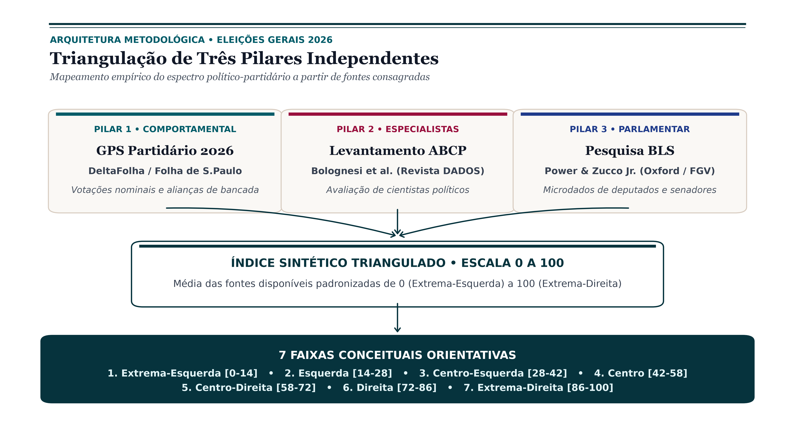
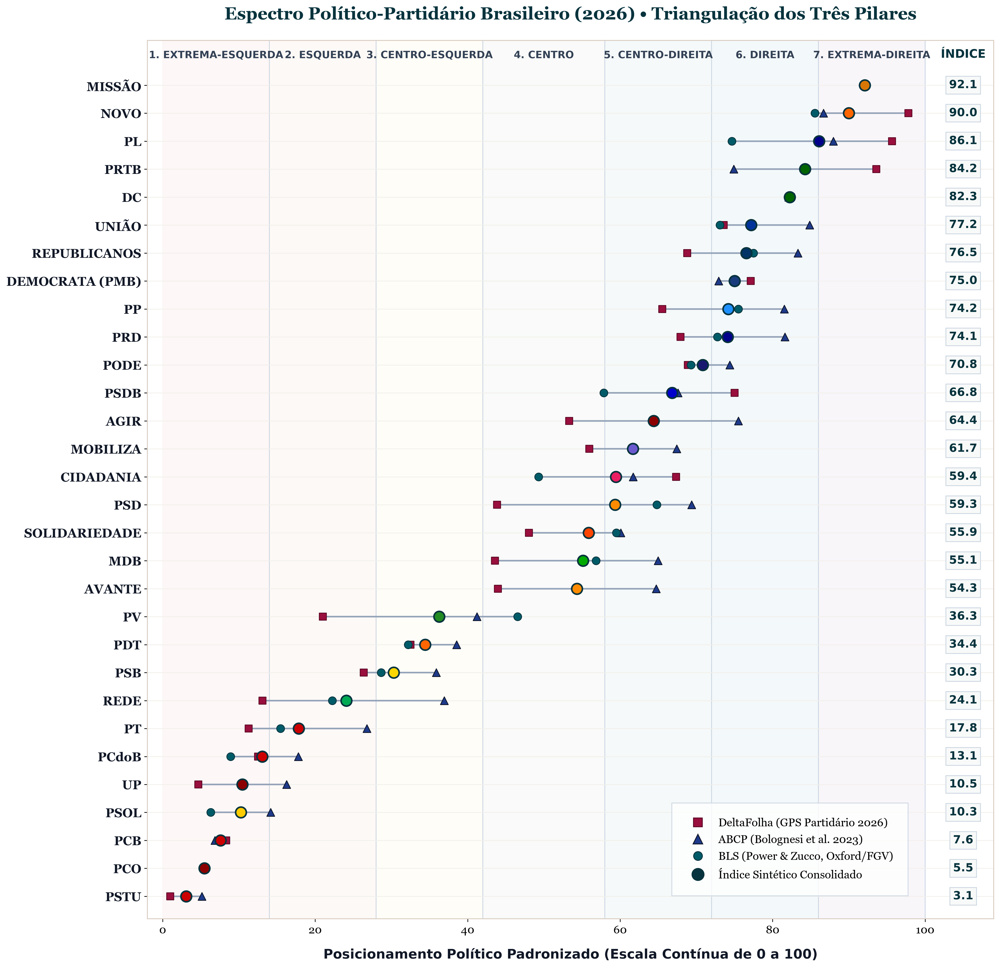
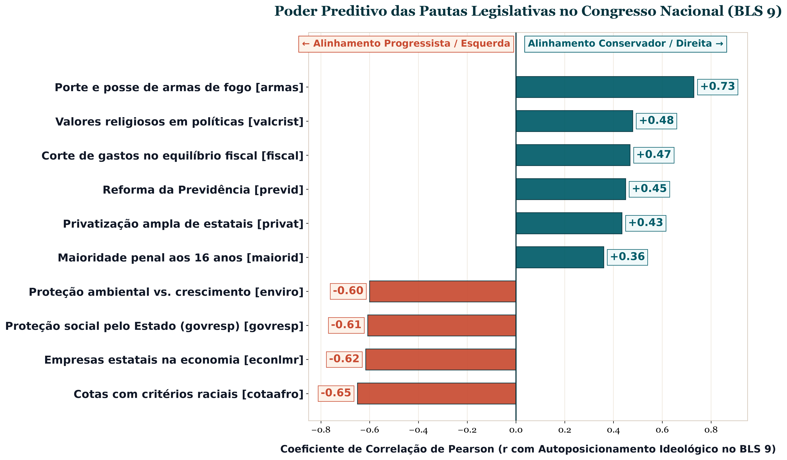
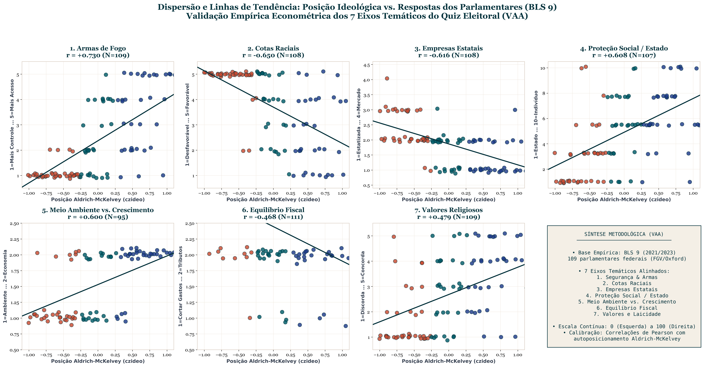

# Relatório Metodológico
## Posicionamento Partidário e Fundamentação do Quiz Eleitoral (VAA)

**Autor:** Vinícius Pinon ([linktr.ee/viniciuspinon](https://linktr.ee/viniciuspinon)) | **Data:** Setembro de 2026 | **Versão:** 2.6 | **Plataforma:** [emquemeuvoto.onrender.com](https://emquemeuvoto.onrender.com)  

---

## 📑 Sumário

1. [Resumo Executivo](#resumo-executivo)
2. [Por que Triangular o Posicionamento dos Partidos?](#1-por-que-triangular-o-posicionamento-dos-partidos)
3. [As Três Fontes e o Índice Sintético](#2-as-três-fontes-e-o-índice-sintético)
   - 3.1. [Fontes Metodológicas Utilizadas](#21-fontes-metodológicas-utilizadas)
   - 3.2. [Cálculo do Índice e as 7 Faixas Orientativas](#22-cálculo-do-índice-e-as-7-faixas-orientativas)
   - 3.3. [Tabela Consolidada das 29 Legendas Partidárias (ABNT)](#23-tabela-consolidada-das-29-legendas-partidárias-abnt)
   - 3.4. [Diagnóstico de Reposicionamento (DeltaFolha 2026)](#24-diagnóstico-de-reposicionamento-deltafolha-2026)
4. [Fundamentação Empírica do Quiz Eleitoral (VAA)](#3-fundamentação-empírica-do-quiz-eleitoral-vaa)
   - 4.1. [As Grandes Clivagens no Parlamento Brasileiro](#31-as-grandes-clivagens-no-parlamento-brasileiro)
   - 4.2. [Validação Empírica: Painel de Dispersão dos Microdados](#32-validação-empírica-painel-de-dispersão-dos-microdados)
   - 4.3. [Matriz de Perguntas e Pesos do Quiz do Cidadão](#33-matriz-de-perguntas-e-pesos-do-quiz-do-cidadão)
5. [Referências Bibliográficas](#4-referências-bibliográficas)

---

## Resumo Executivo

Este documento detalha os critérios metodológicos adotados pela plataforma cívica independente **Em Quem Eu Voto 2026** para estimar o posicionamento político-partidário e fundamentar empiricamente o questionário de afinidade eleitoral (quiz). A metodologia estabelece uma abordagem descritiva, reproduzível e auditável, ancorada exclusivamente em dados observáveis e pesquisas consagradas da Ciência Política:

* **Triangulação de Três Fontes Independentes:** Para mitigar distorções e evitar a dependência de narrativas conjunturais ou fontes isoladas, a plataforma combina três pilares consolidados da Ciência Política brasileira:
  1. *A Visão dos Próprios Parlamentares:* **Brazilian Legislative Survey (BLS / Oxford e FGV)**, pesquisa direta com deputados e senadores em exercício;
  2. *A Avaliação de Especialistas:* **Levantamento da ABCP (Bolognesi et al., 2023)**, consulta sistemática a pesquisadores e cientistas políticos;
  3. *O Comportamento Concreto:* **GPS Partidário (DeltaFolha, 2026)**, mensuração empírica multidimensional estruturada em cinco eixos (votações nominais no plenário, migrações na janela partidária, frentes parlamentares, coligações eleitorais e doações financeiras).
* **Régua Contínua Padronizada (0 a 100):** As escalas foram linearmente convertidas para uma métrica uniforme de 0,0 (Extrema-Esquerda) a 100,0 (Extrema-Direita), organizada em 7 faixas conceituais orientativas para facilitar a interpretação pelo cidadão.
* **Transparência Metodológica para Partidos Estreantes:** Legendas recém-registradas no TSE ou sem histórico de votações consolidadas com bancada legislativa são documentadas com sinalização formal explícita sobre a extensão de dados disponível, sem estimativas arbitrárias.
* **Perguntas Baseadas em Dados Reais do Congresso:** As 7 afirmações do quiz eleitoral foram formuladas a partir de microdados reais de 109 parlamentares federais na Pesquisa Legislativa Brasileira (BLS 9), assegurando correspondência com as clivagens substantivas do debate legislativo nacional.
* **Autonomia do Cidadão e Finalidade Informativa:** A plataforma não possui caráter prescritivo nem busca definir o voto do usuário. Seu papel é exclusivamente orientativo, permitindo ao cidadão compreender os posicionamentos médios das legendas e filtrar candidatos livremente.

---

## 1. Por que Triangular o Posicionamento dos Partidos?

No sistema político brasileiro, classificar legendas partidárias a partir de um único critério analítico introduz vieses sistemáticos:
* **Estatutos Partidários:** Em geral contêm declarações de princípios abrangentes e genéricas, pouco elucidativas sobre a disciplina de bancada no plenário.
* **Discursos de Lideranças:** Respondem frequentemente a conveniências conjunturais e estratégias discursivas imediatas de períodos eleitorais.
* **Apoio a Governos no Presidencialismo de Coalizão:** A adesão de partidos a governos federais envolve partilha de cargos, ministérios e emendas parlamentares, fenômeno que nem sempre expressa afinidade ideológica substantiva.

A triangulação de três fontes independentes atenua ruídos idiossincráticos e captura facetas complementares da vida partidária:

| Dimensão Analítica | Fonte Metodológica | Objeto Observado na Prática |
| :--- | :--- | :--- |
| **Olhar dos Representantes** | BLS (Power & Zucco, Oxford/FGV) | Como os próprios parlamentares em exercício posicionam a si mesmos e aos seus pares. |
| **Olhar dos Especialistas** | ABCP (Bolognesi et al., Revista DADOS) | Avaliação sistemática de pesquisadores e professores vinculados à Ciência Política. |
| **Olhar Comportamental** | DeltaFolha (GPS Partidário, 2026) | Votações nominais na Câmara (IRT), migrações partidárias, frentes e coligações eleitorais. |

---

## 2. As Três Fontes e o Índice Sintético

  
*Figura 1: Arquitetura metodológica de triangulação de três pilares independentes para o espectro partidário 2026 (Broadsheet Civic-Tech).*

### 2.1. Fontes Metodológicas Utilizadas

1. **Pilar 1 — Brazilian Legislative Survey (BLS / Power & Zucco, Oxford e FGV):** Pesquisa longitudinal de referência internacional que coleta dados diretamente de parlamentares federais desde 1990. Aplica a correção de *Aldrich-McKelvey* para homogeneizar as escalas de percepção dos respondentes contra o problema do funcionamento diferencial dos itens (DIF).
2. **Pilar 2 — Levantamento com Especialistas da ABCP (Bolognesi, Ribeiro & Codato, 2023):** Consulta periódica a centenas de especialistas vinculados à Associação Brasileira de Ciência Política, publicada na revista acadêmica *DADOS*, abrangendo também agremiações de fusão recente e legendas menores.
3. **Pilar 3 — GPS Partidário 2026 (DeltaFolha / Folha de S.Paulo, 2026):** Mapeamento empírico multidimensional baseado em cinco dimensões observáveis de dados abertos do Congresso e do TSE: votações nominais no plenário da Câmara dos Deputados (Item Response Theory), migrações de bancada na janela partidária, frentes parlamentares, alianças eleitorais e redes de doadores.

### 2.2. Cálculo do Índice e as 7 Faixas Orientativas

Todas as escalas originais foram convertidas para uma métrica uniforme de 0,0 (Extrema-Esquerda) a 100,0 (Extrema-Direita). O **Índice Sintético Consolidado** é a média aritmética simples das fontes disponíveis para cada partido.

Para orientar a navegação do cidadão na plataforma, o espectro contínuo é organizado em 7 faixas conceituais enumeradas:

1. **Faixa 1 — Extrema-Esquerda (0 a 14):** PSTU (3,1), PCO (5,5), PCB (7,6), UP (10,5).
2. **Faixa 2 — Esquerda (14 a 28):** PSOL (10,3), PCdoB (13,1), PT (17,8).
3. **Faixa 3 — Centro-Esquerda (28 a 42):** REDE (24,1), PSB (30,3), PDT (34,4), PV (36,3).
4. **Faixa 4 — Centro (42 a 58):** Avante (54,3), MDB (55,1), Solidariedade (55,9), PSD (59,3), Cidadania (59,4), Mobiliza (61,7).
5. **Faixa 5 — Centro-Direita (58 a 72):** Agir (64,4), PSDB (66,8), Podemos (70,8), PP (74,2).
6. **Faixa 6 — Direita (72 a 86):** PRD (74,1), PMB/Democrata (75,0), Republicanos (76,5), União Brasil (77,2), DC (82,3).
7. **Faixa 7 — Extrema-Direita (86 a 100):** PRTB (84,2), PL (86,1), NOVO (90,0), Missão (92,1).

### 2.3. Tabela Consolidada das 29 Legendas Partidárias (ABNT)

  
*Figura 2: Dispersão espacial dos partidos brasileiros comparando as três fontes independentes e o índice sintético consolidado.*

A tabela a seguir consolida as pontuações individuais de cada estudo e o índice sintético final das legendas registradas perante o TSE, formatada segundo as diretrizes de apresentação tabular da ABNT/IBGE:

| Sigla | Nome Oficial perante o TSE | Folha '26 | ABCP '22 | BLS | Índice | Faixa | Classificação |
| :--- | :--- | :---: | :---: | :---: | :---: | :---: | :--- |
| **PSTU** | Partido Socialista dos Trabalhadores Unificado | 1,0 | 5,1 | — | **3,1** | 1 | Extrema-Esquerda |
| **PCO** | Partido da Causa Operária | — | 5,5 | — | **5,5** | 1 | Extrema-Esquerda |
| **PCB** | Partido Comunista Brasileiro | 8,3 | 6,9 | — | **7,6** | 1 | Extrema-Esquerda |
| **PSOL** | Partido Socialismo e Liberdade | 10,4 | 14,1 | 6,3 | **10,3** | 2 | Esquerda |
| **UP** | Unidade Popular | 4,7 | 16,3 | — | **10,5** | 1 | Extrema-Esquerda |
| **PCdoB** | Partido Comunista do Brasil | 12,5 | 17,8 | 8,9 | **13,1** | 2 | Esquerda |
| **PT** | Partido dos Trabalhadores | 11,3 | 26,8 | 15,5 | **17,8** | 2 | Esquerda |
| **REDE** | Rede Sustentabilidade | 13,1 | 36,9 | 22,3 | **24,1** | 3 | Centro-Esquerda |
| **PSB** | Partido Socialista Brasileiro | 26,4 | 35,9 | 28,6 | **30,3** | 3 | Centro-Esquerda |
| **PDT** | Partido Democrático Trabalhista | 32,5 | 38,5 | 32,2 | **34,4** | 3 | Centro-Esquerda |
| **PV** | Partido Verde | 21,0 | 41,2 | 46,5 | **36,3** | 3 | Centro-Esquerda |
| **AVANTE** | Avante | 44,0 | 64,7 | — | **54,3** | 4 | Centro |
| **MDB** | Movimento Democrático Brasileiro | 43,6 | 65,0 | 56,9 | **55,1** | 4 | Centro |
| **SOLIDARIEDADE** | Solidariedade | 48,0 | 60,1 | 59,5 | **55,9** | 4 | Centro |
| **PSD** | Partido Social Democrático | 43,9 | 69,4 | 64,8 | **59,3** | 4 | Centro |
| **CIDADANIA** | Cidadania | 67,3 | 61,7 | 49,3 | **59,4** | 4 | Centro |
| **MOBILIZA** | Mobilização Nacional | 56,0 | 67,4 | — | **61,7** | 4 | Centro |
| **AGIR** | Agir | 53,3 | 75,5 | — | **64,4** | 5 | Centro-Direita |
| **PSDB** | Partido da Social Democracia Brasileira | 75,0 | 67,6 | 57,8 | **66,8** | 5 | Centro-Direita |
| **PODE** | Podemos | 68,9 | 74,4 | 69,3 | **70,8** | 5 | Centro-Direita |
| **PRD** | Partido Renovação Democrática | 67,9 | 81,6 | 72,8 | **74,1** | 6 | Direita |
| **PP** | Progressistas | 65,5 | 81,5 | 75,5 | **74,2** | 5 | Centro-Direita |
| **PMB / DEMOCRATA** | Democrata (registro PMB) | 77,1 | 72,9 | — | **75,0** | 6 | Direita |
| **REPUBLICANOS** | Republicanos | 68,8 | 83,3 | 77,5 | **76,5** | 6 | Direita |
| **UNIÃO** | União Brasil | 73,6 | 84,8 | 73,1 | **77,2** | 6 | Direita |
| **DC** | Democracia Cristã | 82,4 | 82,1 | — | **82,3** | 6 | Direita |
| **PRTB** | Partido Renovador Trabalhista Brasileiro | 93,6 | 74,9 | — | **84,2** | 7 | Extrema-Direita |
| **PL** | Partido Liberal | 95,7 | 88,0 | 74,6 | **86,1** | 7 | Extrema-Direita |
| **NOVO** | Partido Novo | 97,8 | 86,7 | 85,6 | **90,0** | 7 | Extrema-Direita |
| **MISSÃO** | Partido Missão (em formação) | 92,1 | — | — | **92,1** | 7 | Extrema-Direita$^*$ |

**Fonte:** Elaborado pelo projeto Em Quem Eu Voto com base em DeltaFolha (2026), Bolognesi et al. (2023) e Power e Zucco Jr. (2023).  
**Nota:** Dados empíricos padronizados na métrica contínua de 0 (Extrema-Esquerda) a 100 (Extrema-Direita). A ausência de valor (—) indica inexistência de medição empírica naquele estudo específico. $^*$O Partido Missão possui mensuração registrada unicamente na dimensão de migração partidária do GPS 2026.

### 2.4. Diagnóstico de Reposicionamento (DeltaFolha 2026)

A integração da edição 2026 do GPS Partidário trouxe deslocamentos empíricos relevantes no comportamento legislativo e eleitoral das agremiações:

1. **PMB / DEMOCRATA (Migração para a Faixa 6 - Direita):**
   A pontuação comportamental no DeltaFolha saltou de $59,45$ (2024) para $77,12$ (2026), refletindo alianças conservadoras e fluxos de filiação. Com isso, o índice sintético subiu de $66,18$ para **$75,02$**, ultrapassando o limiar de corte de $72,0$ e ingressando formalmente na **Direita**.
2. **PRD (Recuo Moderador):**
   Com a consolidação da fusão PTB-Patriota e maior heterogeneidade de suas bancadas regionais, a nota da Folha recuou de $84,34$ para $67,92$. O índice sintético ajustou-se para **$74,09$** (permanece na **Direita**, mas agora muito mais próximo do centro do bloco parlamentar de PP e Podemos).
3. **AGIR (Movimento em Direção ao Centro):**
   A nota comportamental recuou de $63,70$ para $53,31$, resultando em índice de **$64,40$** (Faixa 5, Centro-Direita).
4. **PSD e MDB (Consolidação Centrista):**
   Ambos registraram redução nas pontuações comportamentais da Folha (MDB de $52,01 \rightarrow 43,58$; PSD de $51,31 \rightarrow 43,87$), refletindo sua atuação pragmática e governista na base legislativa. O índice sintético consolidou-os com clareza na **Faixa 4 (Centro)**: MDB com **$55,14$** e PSD com **$59,35$**.
5. **PARTIDO MISSÃO (Incorporação com Nota Isolada):**
   Pela primeira vez mapeado pelo DeltaFolha na dimensão de migração partidária (cluster "direita_3"), o Partido Missão obteve nota **$92,08$** (Faixa 7, Extrema-Direita). Como a legenda ainda não possui medição em surveys do BLS ou da ABCP, seu registro é mantido com nota explicativa de transparência metodológica.

---

## 3. Fundamentação Empírica do Quiz Eleitoral (Voting Advice Application — VAA)

> **💡 O que é uma VAA?**  
> **VAA (*Voting Advice Applications*)** é a denominação acadêmica internacional para aplicações digitais de afinidade eleitoral (conhecidas popularmente como "bússolas eleitorais" ou "quizzes políticos"). Sua finalidade é estritamente informativa e pedagógica: confrontar preferências do eleitor com posicionamentos médios conhecidos, auxiliando-o a mapear afinidades e a filtrar opções, sem qualquer juízo normativo ou direcionamento de voto.

Questionários de afinidade eleitoral frequentemente enfrentam restrições metodológicas por formularem dilemas excessivamente abstratos. Para que as afirmações refletissem clivagens reais da política brasileira, as 7 questões do **Em Quem Eu Voto** foram selecionadas a partir de microdados reais de 109 parlamentares federais na **Pesquisa Legislativa Brasileira (BLS 9 / FGV e Oxford)**.

  
*Figura 3: Coeficientes de correlação de Pearson (r) entre temas de políticas públicas e a posição ideológica no Congresso Nacional (BLS 9).*

### 3.1. Clivagens Temáticas Correlacionadas à Ideologia Parlamentar

A análise empírica dos microdados do BLS aponta que há eixos temáticos correlacionados com o posicionamento ideológico dos parlamentares e das legendas partidárias no Brasil:

1. **Acesso a Armas de Fogo (`armas`, $r = +0,730$, $N = 109$):** O tema com maior capacidade de diferenciação empírica na amostra parlamentar. A flexibilização da posse e do porte civil de armas correlaciona-se expressivamente com o campo de direita.
2. **Cotas com Critérios Étnico-Raciais (`cotaafro`, $r = -0,650$, $N = 108$):** A defesa enfática da reserva de vagas nas universidades públicas para estudantes negros e indígenas é um dos principais marcadores do campo de esquerda. Distingue-se expressamente de cotas gerais por critério exclusivamente de renda.
3. **Papel do Estado na Economia (`econlmr`, $r = -0,616$, $N = 108$):** A manutenção de empresas estatais em setores estratégicos da economia (como energia e combustíveis) separa visões de primazia pública e liberalismo de mercado.
4. **Proteção Social e Responsabilidade do Estado (`govresp`, $r = -0,608$, $N = 107$):** O entendimento de que o Estado deve ter como papel primordial a garantia do bem-estar social e da proteção coletiva, contraposto à visão de primazia da responsabilidade individual.
5. **Proteção Ambiental vs. Crescimento Econômico (`enviro`, $r = -0,600$, $N = 95$):** A primazia da preservação ecológica, mesmo quando impõe limites ao ritmo de expansão de projetos industriais e agropecuários, correlaciona-se com posições de esquerda.
6. **Diretrizes da Política Fiscal (`fiscal`, $r = +0,468$, $N = 111$):** A busca do equilíbrio das contas públicas prioritariamente pelo corte de despesas em contraposição à revisão de receitas e elevação de tributos.
7. **Valores Religiosos em Políticas Públicas (`valcrist`, $r = +0,479$, $N = 109$):** A promoção de preceitos e valores religiosos em programas educacionais e diretrizes sociais de governo correlaciona-se com o campo conservador.

### 3.2. Validação Empírica: Painel de Dispersão dos Microdados

Para manter a transparência sobre as clivagens selecionadas, o gráfico abaixo expõe a dispersão das respostas individuais dos deputados federais e senadores ($N=109$) em função de sua posição ideológica calculada pelo método *Aldrich-McKelvey* (`czideo`), acompanhada da reta de regressão linear por mínimos quadrados ordinários (OLS) nos 7 eixos do questionário:

  
*Figura 4: Painel de dispersão dos microdados parlamentares (BLS 9) nos 7 eixos temáticos do Quiz e síntese metodológica, acompanhados de retas de regressão linear (OLS).*

A inclinação das retas e a distribuição dos grupos parlamentares (vermelho para esquerda, verde para centro e azul para direita) ilustram como os 7 temas selecionados dialogam com posicionamentos concretos observados no Congresso Nacional.

### 3.3. Matriz de Perguntas e Pesos do Quiz do Cidadão

O questionário apresenta 7 afirmações calibradas, projetadas para oferecer concordância intuitiva na escala Likert (onde 1 é sempre *Discordo* e 7 é sempre *Concordo*), garantindo rigor e consistência cognitiva ao cidadão:

| Eixo Temático | Afirmação Apresentada ao Cidadão | Variável BLS | Correlação ($r$) | Vetor Ideológico |
| :--- | :--- | :---: | :---: | :--- |
| **1. Segurança & Armamento** | O cidadão comum deveria ter maior facilidade para possuir e portar armas de fogo. | `armas` | $+0,730$ | **Direita (+)** |
| **2. Ações Afirmativas** | Universidades públicas devem manter cotas com critérios étnico-raciais para estudantes negros e indígenas. | `cotaafro` | $-0,650$ | **Esquerda (−)** |
| **3. Papel do Estado** | O Estado deve manter empresas estatais em setores estratégicos da economia, como energia e combustíveis. | `econlmr` | $-0,616$ | **Esquerda (−)** |
| **4. Proteção Social** | O Estado deve ter como papel primordial garantir a proteção social e o bem-estar de todos os cidadãos. | `govresp` | $-0,608$ | **Esquerda (−)** |
| **5. Meio Ambiente** | A preservação ambiental deve ser prioritária, mesmo que limite ou desacelere o crescimento econômico. | `enviro` | $-0,600$ | **Esquerda (−)** |
| **6. Política Fiscal** | O equilíbrio das contas públicas deve ser buscado prioritariamente pelo corte de despesas, e não pelo aumento de impostos. | `fiscal` | $+0,468$ | **Direita (+)** |
| **7. Valores e Laicidade** | O governo deve promover valores religiosos nas políticas públicas e na educação. | `valcrist` | $+0,479$ | **Direita (+)** |

**Fonte:** Elaborado pelos autores a partir dos microdados da 9ª onda do *Brazilian Legislative Survey* (Power & Zucco Jr., 2023).

---

## 4. Referências Bibliográficas

* ALDRICH, John H.; McKELVEY, Richard D. A method of scaling with applications to the political issues of the 1970 presidential election. **American Political Science Review**, v. 71, n. 1, p. 111-130, 1977.
* BOLOGNESI, Bruno; RIBEIRO, Ednaldo; CODATO, Adriano. Uma nova classificação ideológica dos partidos políticos brasileiros. **DADOS — Revista de Ciências Sociais**, Rio de Janeiro, v. 66, n. 2, e20210164, 2023. DOI: 10.1590/dados.2023.66.2.291.
* FOLHA DE S.PAULO / DELTAFOLHA. **GPS Partidário 2026: Código aberto e dados do GPS ideológico em 5 dimensões**. São Paulo: Repositório GitHub DeltaFolha, 2026.
* POWER, Timothy J.; ZUCCO JR., Cesar. Estimating ideology of Brazilian legislative parties, 1990–2005: A research communication. **Latin American Research Review**, v. 44, n. 1, p. 218-246, 2009.
* POWER, Timothy J.; ZUCCO JR., Cesar. **Brazilian Legislative Survey (Waves 1-9, 1990-2021)**. Harvard Dataverse, Cambridge, 2023. DOI: 10.7910/DVN/WM9IZ.
* TRIBUNAL SUPERIOR ELEITORAL (TSE). **Repositório de Dados Eleitorais: Estatísticas e Candidaturas 2026**. Brasília: TSE, 2026.

---

**Em Quem Eu Voto 2026** • [emquemeuvoto.onrender.com](https://emquemeuvoto.onrender.com)
